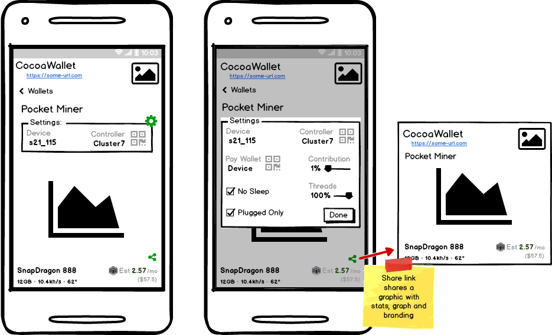

# CocoaWallet for Android/ARM64

Soon to be to be the friendliest self-funding privacy wallet.

## Development roadmap

1. [ ] Milestone: Get XMRIG to execute inside APK
  * Is XMRIG running properly? I'm getting no data back.
  * After it works with xmrig, replace with pocketMiner

2. [ ] Milestone: Dramatically improve and simplify UI for miner
  * expanding settings sections
  * live graph
  * QR code scanner
  * initially with only remote CocoaWallet
  * share screen shot of graph with link
  * Also add link to view total wallet activity on pool
  * Coin API from CoinCalulators.io, ex: (save values and update every hour or two)
    * https://www.coincalculators.io/api
    * https://www.coincalculators.io/api?name=dero&hashrate=2500&power=30&poolfee=.01&powercost=0.06
    * returns a JSON including:
      * "rewardsInMonth": 1.6642676599849622
      * "revenueInMonthUSD": 29.321479324996904

3. [ ] Milestone: Refactor code to be simple and clean
  * feature: turn off mining when not plugged, turn on automatically when plugged
  * feature: turn off when battery low, turn on when battery reaches >25%
  * simplify settings with default configs somewhere easy to edit
    * contribute wallet, default pool url & port, default wallet

4. [ ] Milestone: Wrap XMRIGCC controller app in simple APK
  * XMRIGCC: https://github.com/untoreh/xmrigCC
  * show connection key in QR code, with scanner in wallet
  * works over local network for network
  * implment free VPN access if not found over local network

5. [ ] Milestone: Integrate in basic DERO wallet functionality
  * seperate page for mangement
  * include auto-payout level (pays all or excess)
  * archive (hide) wallet which becomes visible again if money is deposited

6. [ ] Milestone: Integrate wallet with some decentralized exchange, like Haveno

## Milestone #2 miner-screen UI wireframe

## Milestone #5 simple wallet functionality

----

### Based on MoneroMiner

Based on the binaries from https://github.com/NanoBytesInc/miners
Which is based on the code from https://github.com/xmrig/xmrig

### Usage

Starts automatically and runs quietly in the background. Will not run at full power unless connected to power. I suggest a cradle with active cooling.

### Notes

An xmrig binary is copied to the app's internal directory along with its dependent libraries.

Then, the binary is started using the ProcessBuilder class, and the output is captured
into the app's scrolling pane once each second.

#### License

xmrig is licensed as GPLv3, thus this derivative work also is.
You need to consider this if you plan to build a "real" Android app. You'd propably need
to make it GPLv3 also, unless you can somehow make use of the GPL clause which allows
to bundle a GPLv3 binary with another propietary licensed binary.

